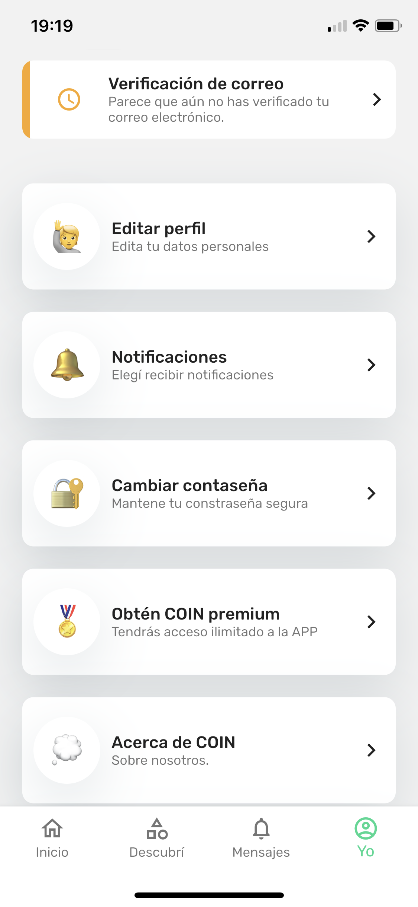

  

  

# Fundamentos de Ingenieria de Software - Obligatorio 1

  

  

## Repositorio

  

**Como vamos a utilizar repo locales y remotos?**

- Creamos un repositorio remoto en Github en el cual se centralizara todo el código.
- Vamos a utilizar las ramas 'main' y 'develop' como las 2 ramas principales, siendo 'main' producción y 'develop' pre-producción, luego también utilizaremos ramas por cada feature que estaremos agregando a la app.
- En primera instancia, es decir, al escribir este documento, usaremos directamente la rama 'develop'.

> Por ejemplo: queremos agregar la funcionalidad de agregar categorías, creamos la rama local 'feature/agregar_categorias', rama en la cual vamos a trabajar localmente y luego al haber terminado, hacer un merge con 'develop'.

Una vez testeado los cambios, si todo está correcto, se hacer merge con main.

  

**Comandos git a utilizar:**

* git init
	* Para crear un nuevo repositorio
* git clone 
	* Es utilizado para crear una copia del repositorio del lugar donde está, a la máquina en la que se está trabajando. Se pude clonar una rama especifica con -b + nombre de la rama, antes de la dirección del repositorio.
* git commit
	* Es utilizado para guardar los cambios realizados en Git. 
* git pull
	* Baja los cambios hechos del repositorio remoto a la máquina local.
* git push
	* Sube los cambios realizados al repositorio.
* git merge
	*  Se utiliza para unir dos ramas.
* git branch
	* Es utilizado para listar las ramas existentes. Crear y eliminar ramas.
* git checkout
	* Es utilizado para salir de una rama y entrar a otra. Asumiendo estas ramas ya existen.
* git add 
	* Es utilizado para contrastar los cambios hechos de forma local, contra el repositorio. Los cambios no son guardados con git add. Para eso debe luego utilizarse git commit.
* git diff
	* Es utilizado para identificar diferencias en el repositorio.
* git stash
	* Es utilizado en caso se quiera guardar temporalmente cambios realizados. Esto permite pasar a otra tarea e impactar los cambios más tarde.

  

  

## Versionado

  

**Buenas practicas del versionado**

Como fue explicado en el punto anterior, usaremos el versionado de git, subiendo cada feature bajo una rama distinta, para así poder identificar y hacer un rollback de la forma más rapida posible.

**Uso de las ramas separadas de main**

También utilizaremos la rama 'develop' como pre-produccion, es decir como una rama de test antes de subir los cambios a main para asi poder evitar subir errores a produccion.

**Resumen de comits y evolución del proyecto**

El nombre de las ramas de features van a seguir un patrón para facilitar el entendimiento de esta y también a la hora del commit, se le agregará un comentario que resuma brevemente la razon de la rama.

>Por ejemplo: quiero agregar la funcionalidad de crear una pagina de FAQ, la rama podría llamarse feature/crear_pagina_FAQ y luego commitearse con el mensaje ' se agrega la pagina FAQ a la app'

En caso de bugs, el nombre puede ser hotfix/nombre_de_rama

## Elicitación

### Tormenta de ideas

La primera técnica utilizada fue la **tormenta de ideas** [*Ver el [Anexo](#anexo-1)* ]. Debido a que es un software que apunta a un público en general, con las definiciones que se tienen en ese momento, y que todos los participantes en el desarrollo del proyecto tienen ingresos y ahorran, pueden desde su experiencia, aportar puntos de vista.

Se pusieron sobre la mesa los conceptos y funcionalidades basicas sobre el producto, en un ambiente relajado, dando rienda suelta a la creatividad previo a atarnos a requisitos que vendran luego en la elicitacion

Como principal conclusion de esta etapa, se genero la idea de "registro de ingresos y egresos" con la meta de poder evaluar luego esta informacion con nuevas funcionalidades. Dentro de estas funcionalidades, se puede generar una seccion de educacion y "tips" , proporcionando asi mayor valor al usuario.

  

### Entrevistas

Como segunda técnica de elicitación se eligieron las entrevistas. Para poder tener de primera mano las opiniones de distintos tipos de usuarios. Se eligieron preguntas abiertas para obtener información a modo general, y algunas más específicas para poder tener información en particular sobre temas que previamente se definió como de importancia en una sesión de Tormenta de ideas.

Nuestro primer acercamiento al proyecto fue mediante dos entrevistas. Nuestro principal objetivo con ambas es el de conseguir un punto de vista mas cercano a lo que debe ser construido y asi definir los requisitos del mismo.

Las personas entrevistadas representaban dos grupos: jovenes buscando comenzar sus ahorros y profesionales mayores que necesiten llevar un mayor control de sus ingresos/egresos.

Luego de ambas entrevistas logramos sacar las siguientes conclusiones:

Considerando ambas entrevistas, lo primero que podemos notar es el fuerte rechazo a imputar datos dentro de jna aplicación, por parte de los entrevistados. Ambos ahorran pero sin embargo dan cifras redondas, por lo que no tienen un control exacto de lo que ahorran. Sumado a las variaciones en el nivel de ahorro de las que son concientes pero no pueden medir con exactitud, podemos aventurar que una aplicación del estilo, les va a ser útil, si es amigable para poder registrar los gastos. Las propuestas de poder registrar los montos mediante el QR de las facturas, y asignarle a cada gasto una etiqueta, cobran más sentido con estas entrevistas, ya que es una forma más dinámica de registrar los gastos, sin tené que imputar los números. Se puede evaluar más adelante para futuras versiones, tener una forma dinámica de obtener el detalle de la factura, como un segundo nivel de clasificación, en jerarquía, por debajo del etiquetado general que hace el usuario. Este dinamismo se puede lograr únicamente con el uso de un dispositivo móvil, el cuál cuenta ya con cámara para leer un QR y se le puede dar una interfaz amigable para que el usuario seleccione la etiqueta para categorizar el gasto.

 #### Evidencia
 Ambas entrevistas realizadas se pueden encontrar [aqui](elicitacion/entrevistas/entrevista-1.md) y [aqui](elicitacion/entrevistas/entrevista-2.md)

### Ingeniería inversa

Como tercer y ultima tenia de felicitación utilizamos la ingeniera inversa. En este caso analizamos en conjunto dos aplicaciones diferentes: [**YNAB budget**](https://www.youneedabudget.com/) y [**CoinApp**](https://coinapp.com.uy/).
Pudimos ver que ambas apuntan al mismo objetivo, pero a diferentes escalas entre  ellas.
Por un lado, **CoinApp** apunta a un usuario mucho mas casual que desea llevar un registro de sus gastos pero no esta tan interesado en aprender a ahorrar mas profundamente. Por ello, las herramientas que ofrece son mucho mas simples.
En cambio, cuando vemos **YNAB budget** podemos denotar un conjunto de herramientas mucho mas completa, teniendo también la principal ventaja de poseer integración con bancos locales.

A continuación se mostrara un desglose de las features mas importantes que pudimos identificar para cada una de ellas:

#### YNAB budget

* Gastos customizables
	* Frecuencia de pago (diario, semanal, mensual).
	* Cantidad a gastar.

* Categorías de los gastos:
	* Entretenimiento, gastos frecuentes, gastos no-mensuales, metas a alcanzar, calidad de vida.
	* Permitir la creación de categorías custom.
	* Marcarlas como categorías indispensables o dispensables.

* Habilidad de planificar los gastos:
	* Permitir una planificación en la cual te avise si superaste tu limite a gastar y que de opciones de redistribuir ese dinero desde otras categorias, priorizando las categorias dispensables.

* Como añadir gastos:
	* Permitir tanto añadir gastos a mano, agregandolos 1 por 1 como automatizar esto permitiendo conectar tu cuenta de banco con la aplicación para que pueda esta ver los movimientos de la cuenta.

* Metrica 'Age of Money'
	* Una metrica que trackea la cantidad de dias en promedio que pasan desde que adquiriste el dinero, hasta que lo gastaste, cuanto mayor sea la cantidad de dias, significa que mayor es la seguridad economica de la persona.

* Tab de información y videos:
	* Videos informativos o articulos sobre como ahorrar, sobre como utilizar la aplicación de forma mas eficiente.

#### CoinApp

* UI
	* Los dos principales métodos de interacción con la App deben ser “Añadir gasto” y “Añadir ingreso”. Estas dos acciones permiten dejar un historial de ingresos/egresos en la cuenta, y por ende, es la función más importante que debemos ofrecer.
	* Mostrar en la primera pantalla un balance de la cuenta en tiempo real, ya que es el principal indicador que tiene el usuario.
    
* Informacion
	* Se debe mostrar una suma de los gastos del último mes. Podríamos analizar también un desglose de los últimos 5 gastos para ser mas especifico y mostrar más control al usuario
    
* Objetivos
	* Dar la posibilidad de crear objetivos de ahorro que serán destinados para un gasto específico, por ejemplo: Un auto, una televisión nueva, entradas a un recital o un viaje.
	* Permitir la posibilidad de crear categorías de gastos y llevar la cuenta por categoría, permitiéndonos hacer ese desglose.
	* Permitir poner límites de gastos (o alertas) para determinadas categorías.
    
* Ahorro cooperativo
	* Evaluar la posibilidad de crear cuentas de ahorro cooperativas en las que diferentes usuarios puedan ahorrar hacia el mismo propósito.

#### Evidencia

Dentro del anexo [Ingenieria Inversa](#ingenieria-inversa) se podran ver las capturas tomadas de ambas aplicaciones

### User Persona

Luego de aplicar las tecnicas documentadas, identificamos dos tipos de personas: 

* Profesional universitario, buscando mejorar sus finanzas 
* Primera experiencia laboral en busca de sus primeros ahorros

## Especificación
  
## Requerimientos funcionales
#### El unico actor que tendremos va a ser el usuario

## RF1: Permitir agregar / quitar gastos.
 - **Actor:** Usuario.
 - **Descripción:** El sistema deberá permitir al cliente agregar gastos completamente customizables, el cliente al apretar el botón de agregar, le va a aparecer un formulario con los detalles de la compra para que luego este se agregue al balance. Tambien al tocar el botón de quitar, este gasto se debe eliminar.
 - **Prioridad:** Alta.
 
 ## RF2: Permitir agregar categorías para los gastos.
 - **Actor:** Usuario.
 - **Descripción:** El sistema deberá permitir al cliente agregar categorías para ordenar mejor los gastos y darle al cliente mas visibilidad al ver los gastos que realizó lo cual ayudará al cliente a sacar mejores conclusiones.
 - **Prioridad:** Alta.

## RF3: Permitir linkear la cuenta de banco con la aplicación.
 - **Actor:** Usuario.
 - **Descripción:** El sistema deberá permitir al cliente agregar una cuenta bancaria para así automatizar completamente todos los gastos e ingresos.
 - **Prioridad:** Media.

## RF4: Importar pagos mediante el QR de los recibos.
 - **Actor:** Usuario.
 - **Descripción:** El sistema deberá permitir al cliente agregar gastos mediante el código QR que tienen los recibos, de este se podrá sacar el monto del gasto y la fecha.
 - **Prioridad:** Alta.
 
 ## RF5: Se debe poder indicar una cantidad de ahorro mensual o anual deseado.
 - **Actor:** Usuario.
 - **Descripción:** El sistema deberá permitir al cliente agregar un ahorro deseado, y que avise al cliente cuando los gastos excedan el limite teniendo este ahorro en cuenta.
 - **Prioridad:** media.

 ## RF6: Agregar metas a alcanzar.
 - **Actor:** Usuario.
 - **Descripción:** El sistema deberá permitir al cliente agregar metas a cumplir, y luego estas metas se deberán tener en cuenta como un gasto mensual hasta que la fecha de esta meta llegue.
 - **Prioridad:** media.

## Requerimientos no funcionales:
**RNF1:** El sistema en su v1 deberá soportar 100 usuarios concurrentes.
**RNF2:** El sistema en su v1 deberá funcionar en ios 14 y android 9.0. 
**RNF3:** El sistema utilizará https como método de seguridad. 
**RNF4:** El sistema utilizará SQRC como método de seguridad para los códigos QR.
**RNF5:** El sistema en su v1 deberá tener como idioma el español e ingles.

**Casos de Uso**

#### Ingreso de Una Factura por QR
Actores: Usuario
Precondición: El usuario ya realizó un gasto.
Sinopsis: El usuario realizó un gasto, y desea registrarlo en la aplicación, para llevar la cuenta del mismo. Abre la aplicación. Elige ingresar nuevo gasto. La cámara se abre y saca una foto al QR. El monto es registrado y le pide asignarle una categoría.
Curso básico:
	1) (Usuario) Abre la aplicación
	2) (Sistema) Muestra el menú de opciones
	3) (Usuario) Elije ingresar nuevo gasto con Agregar Gasto.
	4) (Sistema) Muestra intefaz para agregar gasto.
	5) (Usuario) Agrega nombre, moneda, y elige la categoría desde una lista desplegable.
	6) (Usuario) Apreta el ícono del botón QR
	7) (Sistema) Abre la cámara
	8) (Usuario) Toma una foto al QR
	9) (Sistema) Lee el QR y obtiene del mismo el monto de la factura. Vuelve al menú anterior.
	10) (Usuario) Presiona Agregar
	11) (Sistema) El gasto es registrado en el sistema.

Curso alternativo: Si el QR no se lee, da mensaje error al leer QR y vuelve al menú anterior. Si falta completar un campo, un pop up avisa que es obligatorio y da opción de agregarlo.

#### Ingreso de Una Factura por imputando el monto
Actores: Usuario
Precondición: El usuario ya realizó un gasto.
Sinopsis: El usuario realizó un gasto, y desea registrarlo en la aplicación, para llevar la cuenta del mismo. Abre la aplicación. Elige ingresar nuevo gasto. El menú se abre y ofrece el campo para ingresar el monto de forma manual. El monto es registrado y le pide asignarle una categoría.
Curso básico:
	1) (Usuario) Abre la aplicación
	2) (Sistema) Muestra el menú de opciones
	3) (Usuario) Elije ingresar nuevo gasto con Agregar Gasto.
	4) (Sistema) Muestra intefaz para agregar gasto.
	5) (Usuario) Agrega nombre, moneda, y elige la categoría desde una lista desplegable.
	6) (Usuario) Imputa el monto en el campo que ofrece el menú.
	7) (Usuario) Presiona Agregar
	8) (Sistema) El gasto es registrado en el sistema.
	

Curso alternativo: Si falta completar un campo, un pop up avisa que es obligatorio y da opción de agregarlo.
  
#### Poner Ingresos mensuales
Actores: Usuario
Precondición: El usuario cuenta con ingresos mensuales y conoce el monto.
Sinopsis: El usuario quiere registrar sus ingresos en la aplicación.
Cusro básico:
	1) (Usuario) Abre la aplicación
	2) (Sistema) Muestra el menú de opciones
	3) (Usuario) Elije del menú Agregar Ingreso.
	4) (Sistema) Muestra el menú de Agregar Ingreso
	5) (Usuario) Completa el nombre del ingreso, el monto y la moneda. Además puede programarlo como ingreso mensual, o puede dejarlo solo como ingreso del mes corriente.
	6) (Sistema) Registra el gasto.

### Bocetos de UI

**Historias de Usuarios**

### Historia usuario Martín
Título: Quiero aprender a ahorrar.

Cómo: Quiero poder medir mis ingesos y egresos y aprender a priorizar los gastos para llegar a mis objetivos de ahorro.

Criterios de aceptación:
	- Le muestra sus objetivos de ahorro y su grado de cumplimiento.
	- Le da tips para ahorrar.
	- Le permite ingresas de forma cómoda en pocos pasos sus gastos y clasificarlos.

### Historia usuario Elizabeth
Título: Controlar gastos con ingresos variables.

Cómo: Quiero poder planificar mis gastos y tener cuenta de datos históricos, ya que mis ingresos son variables por comisión.

Criterios de aceptación:
	- Le permite agregar diferentes montos de ingreso cada mes
	- Le permite fijar diferentes objetivos de ahorro mensuales.
	- Le muestra un histórico de sus gastos.

## Validación y verificación

  

  

placeholder

  

  

## Reflexión

  

  

test

  

## Anexos

  

### Elicitacion

#### Tormenta de ideas

#### Ingenieria inversa

<b>CoinApp</b>

 

<b>YNAB budget</b>

