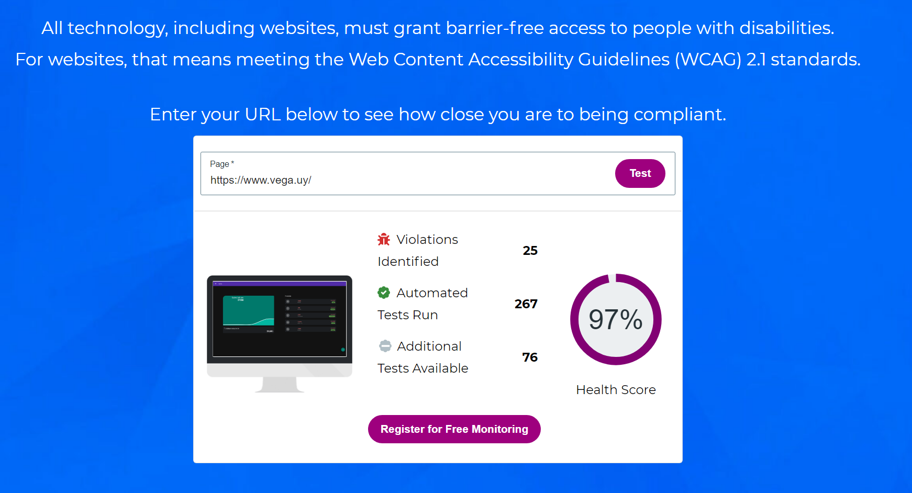

# Parte 2

## Construcción

### Implementación de funciones principales

Se implementaron las funciones de agregar gastos y agregar ingresos. Para ambas funciones se agrega un nombre, un monto, una fecha, una categoría solo para los egresos, y se marca si debe o no programarse mensualmente. 

También se puede ver el historial de ingresos y el de egresos por separado.

A su vez puede agregarse un ahorro nuevo. Esto serían ahorros previos del usuario, al momento de comenzar a usar la aplicación. Se ingresa nombre, monto fecha, y queda la opción de programarlo mensualmente.

### Configuración de plataforma tecnológica para desarrollo y producción

### Documentación del uso de librerías externas (package.json)
> La documentación de package.json quedó también como anexo en package.md.

#### Documentación package.json

##### Dominio
Nombre: Dominio
Versión: 1.0.0
Descripción: Mis Gastos dominio.

###### Scripts
Para test se utiliza jest con el parámetro coverage, para tener indicador de la cobertura de los tests realizados. Se cubre un 100%

testWindows Se utiliza para poder testar en sistemas operativos Windows con Jest.

###### Dependencias 

Jest 26.6.3 Para realizar tests unitarios
Eslint 7.28.0 Para el análisis estático del código.

##### Interfaz
Nombre: Interfaz
Versión: 1.0.0
Descripción: Mis Gastos interfaz
Privada

###### Scripts
Se utiliza webpack como built-in script.
start levanta webpack.
watch recompila archivos de webpack cuando cambian.
build toma la variable de enviroment de Node.js.
build dev corre webpack.
clean borra la capreta dist.

###### Dependencias
Babel 7.16.0 Es utilizado para que el códio ECMAScript sea compatible con motores anteriore de JS.

Con Babel preset-env 7.16.0 no hay necesidad de indicar a que versión de JS convertir el código.

Babel loader 8.2.3 permite gestionar a medida Babel para cada archivo que procesa. Viene con webpack.

Clean webpack plugin 4.0.0 remueve o limpia output.path de todos los activos de webpack no usados después de un build exitoso.

css-loader 6.5.1 habilita o deshabilita el manejo de funciones de CSS desde webpack.

html-webpack-plugin 5.5.0 simplifica la creación de archivos html para webpack.

mini-css-extract-plugin 2.4.3 Este plugin extrae CSS en archivos separados. Crea un archivo CSS por archivo JS que contiene CSS. Es compatible con la carga bajo demanda de CSS y SourceMaps. Funciona a partir de webpack 5.

sass 1.43.4 Este paquete es una distribución de Dart Sass, compilado en JavaScript puro sin código nativo ni dependencias externas. Proporciona un ejecutable sass de línea de comandos y una API de Node.js.

sass-loader 12.3.0 Permite controlar las versiones de todas las dependencias y elegir qué implementación de Sass usar.
Con sass-loader junto a css-loader y style-loader se aplican inmediatamente todos los estilos al DOM o el mini-css-extract-plugin para extraerlos en archivos separados.

webpack 5.36.0 Webpack es un paquete de módulos. Su propósito principal es agrupar archivos JavaScript para su uso en un navegador, pero también es capaz de transformar, agrupar o empaquetar casi cualquier recurso o activo.

webpack-cli 4.6.0 cliente de línea de comandos para webpack.

webpack-dev-server 3.11.2 webpack-dev-server está configurado de forma predeterminada para permitir el refresh en vivo de archivos a medida que se editan los activos mientras el servidor está levantado.

##### Licencia 
ISC

## Interfaz de usuario

La interfaz de usuario es tanto para web como para mobile, ya que es responsiva, se adapta a ambos tipos de dispositivos. Quedó en una única página donde se navega entre secciones, con el nombre index.html bajo el directorio de interfaz. 

Se implementó material desing para el diseño. Se pueden apreciar El header con el Menú hamburguesa en el ángulo superior izquierdo, el cuál permite la navegación a las distintas secciones, así como también en el ángulo inferior derecho, el botón de (+) para realizar las principales acciones. La paleta de colores también respeta material design, siendo el Deep Purple 700 el color principal, y Teal 700 el secundario.

Se cumple con los principios de accesibilidad WCAG. Para eso se probó la aplicación en el sitio https://www.webaccessibility.com/ que prueba si una página cumple con los standares WCAG, donde se obtuvo un puntaje del 97%.

## Codificación

Los programadores utilizaron como IDE Visual Code en sus correspondientes máquinas personales para desarrollo local. Los estándares de codificación a seguir son los utilizados por Google, tanto para HTML, como para CSS y JavaScript. Se puede consultar más información sobre dichos estándares en los siguientes links:

* [HTML & CSS](https://google.github.io/styleguide/htmlcssguide.html)
* [JavaScript](https://google.github.io/styleguide/jsguide.html)

Se utilizaron buenas prácticas de OOP. La lógica y la interfaz quedaron separadas en diferentes directorios. Las clases utilizadas son:

* balance.js
* category.js
* expense.js
* income.js
* savings.js

Para el análisis estático del código se utilizó eslint.js que puede configurarse para realizar el análisis estático del código, siguiendo el estilo de codificación de Google.

## Test Unitario

Se utilizó Jest para realizar el testing unitario. Los test quedaron bajo la carpeta test en el directorio de dominio, y se creó un test por clase, alcanzando un 100% de cobertura.

 PASS  tests/income.test.js                                                                                            
 PASS  tests/balance.test.js
 PASS  tests/saving.test.js
 PASS  tests/category.test.js
 PASS  tests/expense.test.js
                                             
File         | % Stmts | % Branch | % Funcs | % Lines | Uncovered Line #s                                              
-------------|---------|----------|---------|---------|-------------------
All files    |     100 |      100 |     100 |     100 | 
 balance.js  |     100 |      100 |     100 |     100 | 
 category.js |     100 |      100 |     100 |     100 | 
 expense.js  |     100 |      100 |     100 |     100 | 
 income.js   |     100 |      100 |     100 |     100 | 
 saving.js   |     100 |      100 |     100 |     100 | 

Test Suites: 5 passed, 5 total
Tests:       18 passed, 18 total

## Test de sistema

Se realizó test al sistema sobre la verisón congelada.

### Testing exploratorio

Sesión de Testing Exploratorio
|  |  |
| -------- | -------- |
| MISIÓN      | Probar casos borde al agregar un gasto     |
| INICIO     | 23/11/2021 20:00     |
| TESTER     | JA, NV, GR     |
| ESTRUCTURA DE DIVISIÓN      | DURACIÓN: Corta (30 minutos) DISEÑO Y EJECUCIÓN DE PRUEBAS: 10% INVESTIGACIÓN Y REPORTES DE DEFECTOS: 80 % ARMADO DE LA SESIÓN: 10% OBJETIVO vs. OPORTUNIDAD: 100 / 0 |
| ARCHIVOS DE DATOS     |  testing_exploratorio_docs/egresos.png    |
| NOTAS DE PRUEBAS     | Agrego nombres de gastos con números. Agrego gastos con números negativos     |
| DEFECTOS     |      |
| INCONVENIENTES     | El gasto con número negativo queda mal el signo. Mejor si permite solo positivo. El gasto de número negativo suma al balance total.     |

|  |  |
| -------- | -------- |
| MISIÓN      | Probar casos borde al agregar un ingreso     |
| INICIO     | 23/11/2021 20:00     |
| TESTER     | JA, NV, GR     |
| ESTRUCTURA DE DIVISIÓN      | DURACIÓN: Corta (30 minutos) DISEÑO Y EJECUCIÓN DE PRUEBAS: 10% INVESTIGACIÓN Y REPORTES DE DEFECTOS: 80 % ARMADO DE LA SESIÓN: 10% OBJETIVO vs. OPORTUNIDAD: 100 / 0 |
| ARCHIVOS DE DATOS     |   testing_exploratorio_docs/ingresos.png   |
| NOTAS DE PRUEBAS     | Agrego nombres de ingresos con números. Agrego ingresos con números negativos     |
| DEFECTOS     |      |
| INCONVENIENTES     | El ingreso con número negativo queda mal el signo. Mejor si permite solo positivo. El ingreso de número negativo se resta al balance total.     |

## Reporte de Issues

Son realizados en la sección de Issues de GitHub

## Reflexión

### Global
Fue un trabajo interesante, mucho más dinámico que la primer parte donde aportó la experiencia profesional y pudo verse también reflejado el trabajo de la primer parte del obligatorio, el cuál facilitó y aclaró el camino a recorrer, lo cuál es distinto tanto de un aplicación con requerimientos ya impuestos, como de una aplicación donde no hay etapas previas de elicitación, lo cuál hace mucho más caótico el desarrollo. Tanto las tecnicas como material design así como el stack utilizado, son utilizados también en la industria al día de hoy, lo cuál hace útil el proyecto para apender o consolidar conocimientos en los mismos.

### Juan Rodríguez
Personalmente me gustó para retomar js que desde p1 no lo utilizaba en profundidad, y para conocer webpack y jest que me parecieron herramientas útiles. Los test de Jest me resultaron similares a los test que se realiza en Postman para probar apis. Mis aportes fueron principalmente en el dominio con la clase categoría, y algunos de los test, así como con la documentación del package y del proyecto. También con el análisis estático del código utilizando eslint y el testing exploratorio. Fue muy valioso para mi la ayuda y experiencia de ambos compañeros que tienen mayores conocimientos en desarrollo con javascript.

## Guillermo Ramírez

## Nicolas Vega

# Presentaciones individuales en clase
Machine Learning en la Ingeniería de Software - Juan Andrés Rodríguez
Material Design Web Components - Nicolas Vega